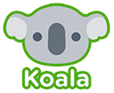

Koala
======

Koala is a mvc framework, it runs on web and mobile platfroms, and doesn't relay on any other framework.

Feature:

+	**modularized**
	koala can automatically load controllers, services, plugins and filters when they are used, you do not need to refer them in the html files like what you must do in angular.
	
	
TODO:
+ write api manual
+ prepare demos
	

